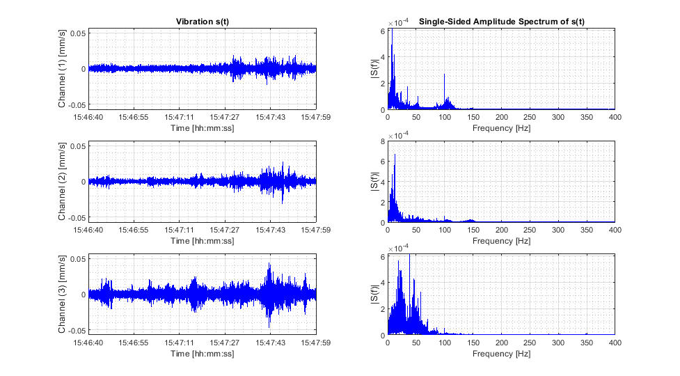
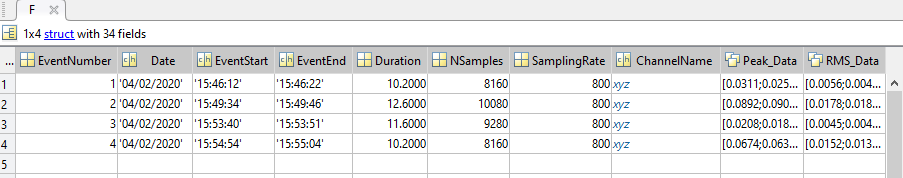

## xmr_data_analyzer

Scripts for reading and analyzing data from BARTEC SYSCOM vibration and motion measurement devices (saved as .xmr file)


#### Visualize data in time and frequency domain

Use `eval_xmr.m` to perform a fast Fourier transform (FFT) and to visualize the data in the time and frequency domain:

```matlab
[M, F] = eval_xmr();
```
with M = file metadata
     F = data




#### Automatically scan recorded data and search for events (e.g. passing trains)

Use `eval_xmr.m` to search for events and to analyze the data according to German Industry Standards DIN 45669-1 and DIN 4150-2:

```matlab
% Example
chn = 'z';          % Channel used for event searching
bg_noise = 0.02;    % Background noise in mm/s
mode = 'cat';       % Automatically concatenates and evaluates all MR3000C files in current folder

[M, F] = eval_xmr(chn, bg_noise, mode);
```
with M = file metadata
     F = data (events)



Comments: If `mode` is set to `'cat'`, file concatenation only occurs when an event is not finished at the end of a file (event searching is performed similar to a rolling window, only data files in window are loaded into memory). All results of the data analysis (events) are written to an Excel-file and additionally saved as MATLAB data file (.mat).


#### Files are stored in different folders respectively on different drives

Use `exec_eval_xmr.m` together with `eval_xmr.m` to search for events and to analyze the data if files are stored in different folders:

```matlab
% Example
chn = 'z';
bg_noise_1 = 0.02;     % Background noise point of measurement 1 (folder A)
bg_noise_2 = 0.01;     % Background noise point of measurement 2 (folder B)
bg_noise_3 = 0.005:    % Background noise point of measurement 3 (folder C)
mode = 'cat';

set_1 = {chn, bg_noise_1, mode};
set_2 = {chn, bg_noise_2, mode};
set_3 = {chn, bg_noise_3, mode};

F = exec_eval_xmr(set_1, set_2, set_3);
```
with F = data (events) per folder


